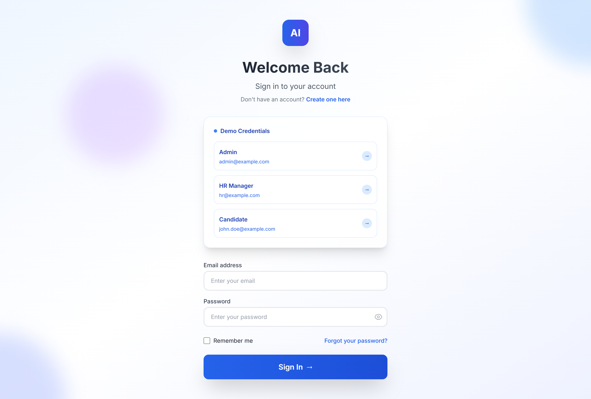
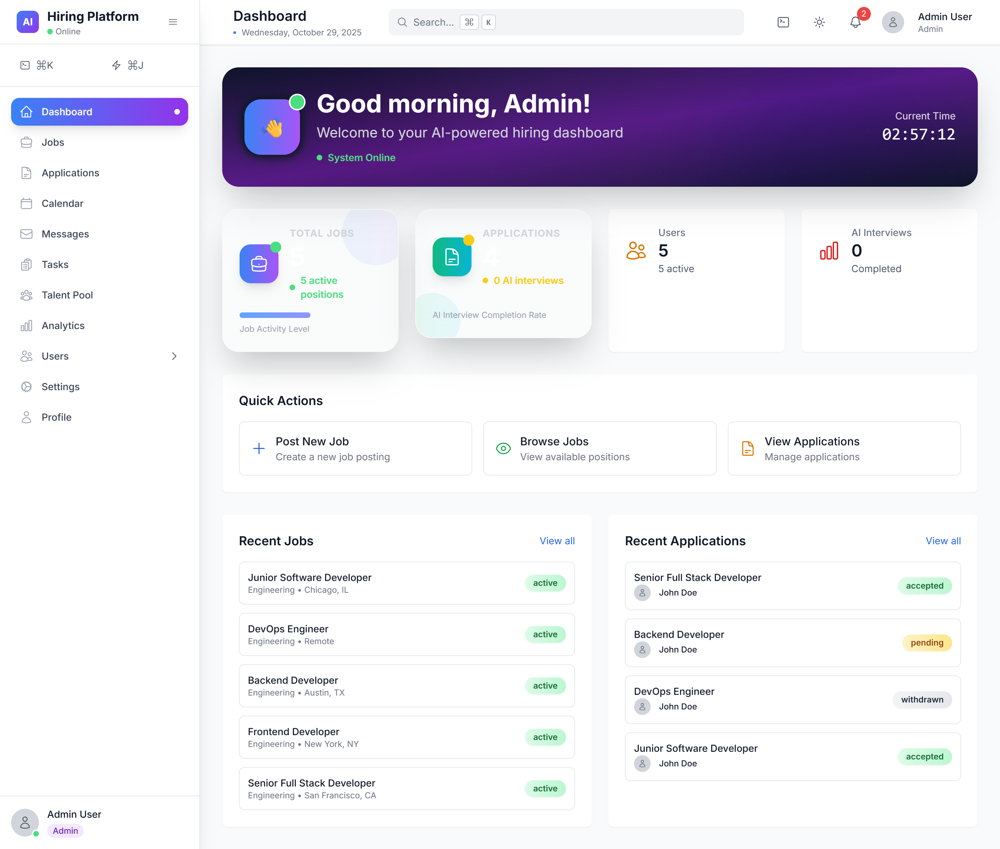
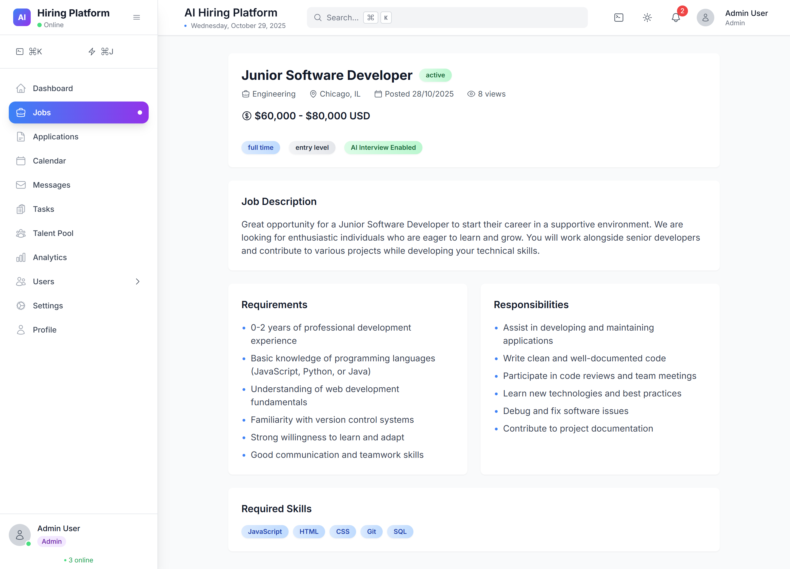
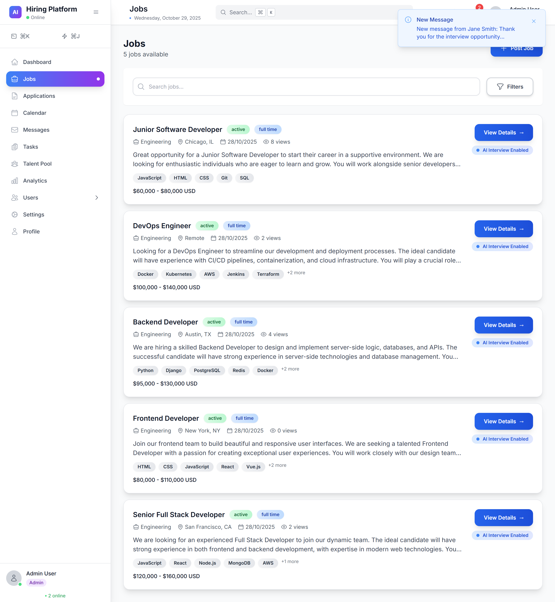
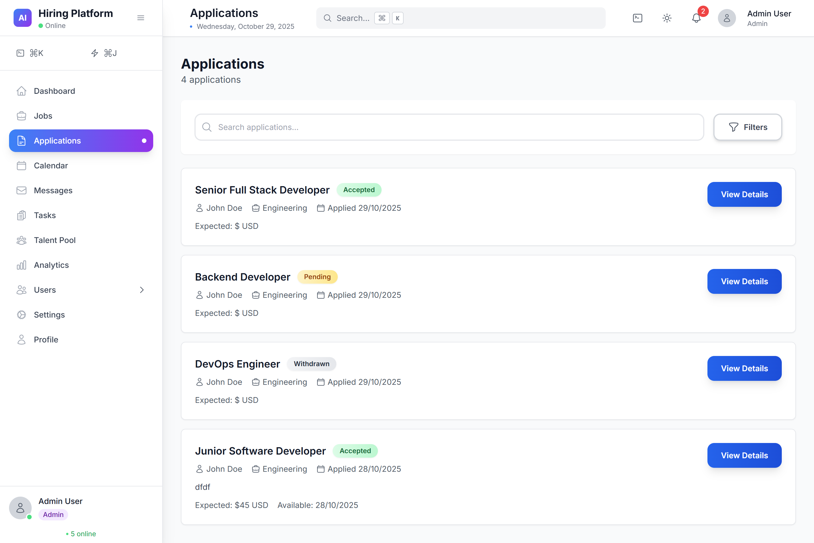
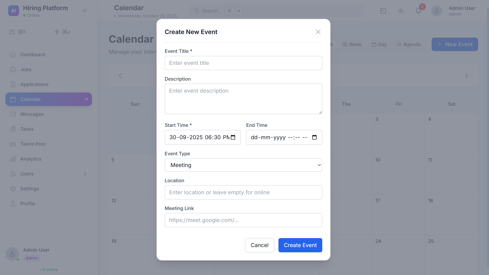
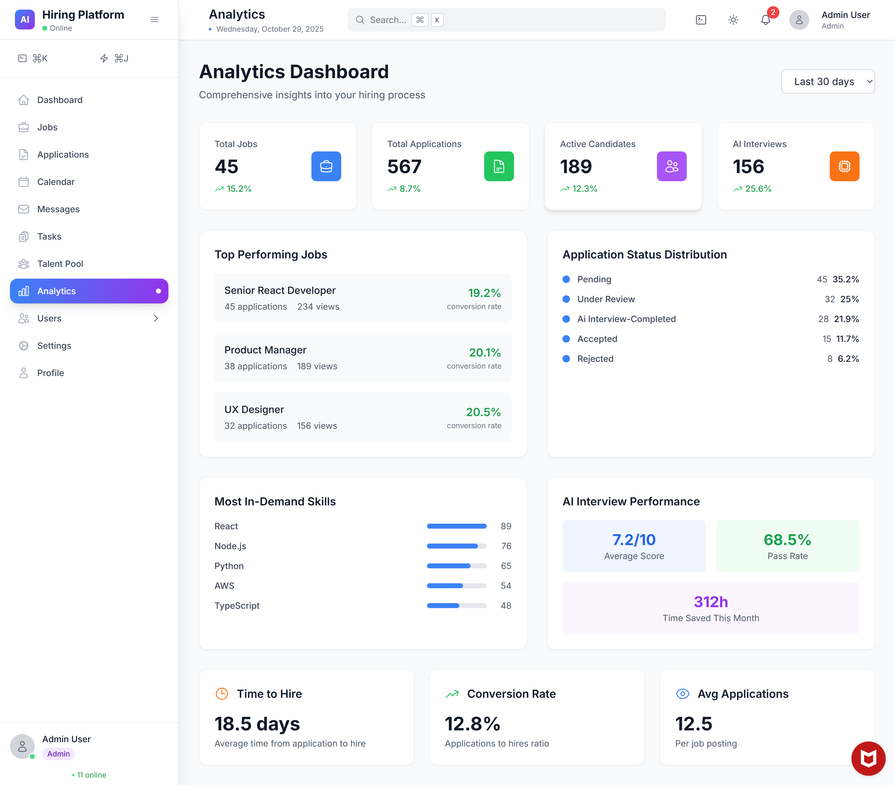
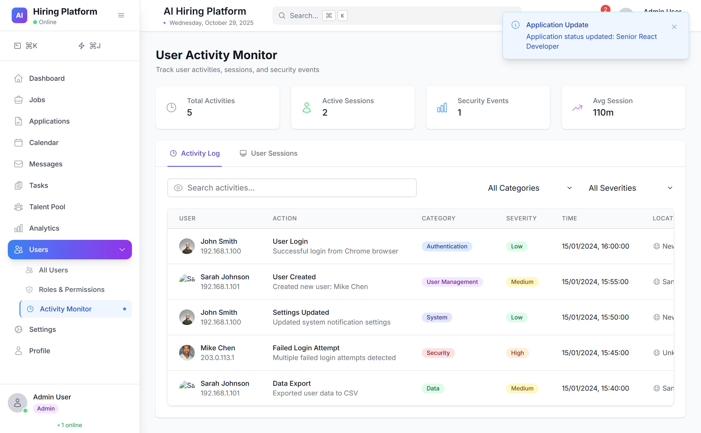
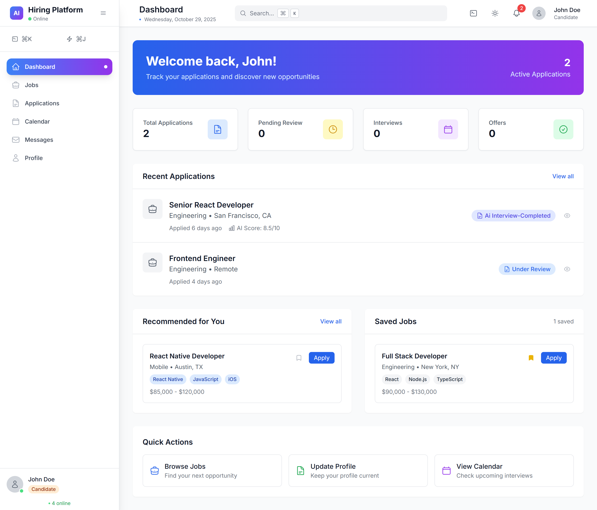
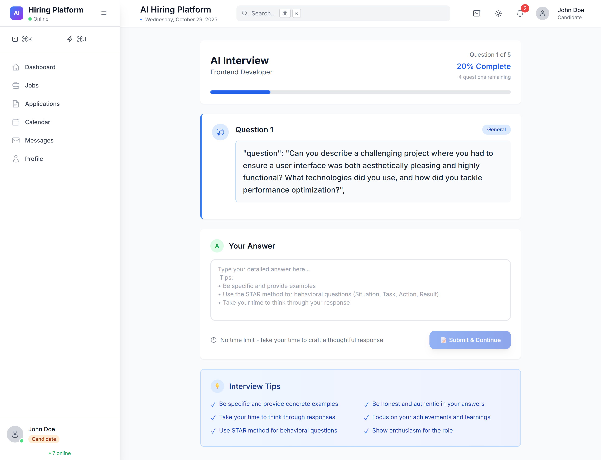

# AI Hiring Platform

A comprehensive hiring application that helps companies manage job postings, applications, and candidate pre-screening through AI-powered interviews.

## 📸 Screenshots

### Application Overview


### User Interface


### Job Management System


### Application Tracking
.png)

### AI Interview System


### Analytics Dashboard


### User Management
.png)

### Settings Panel


### Role Management
.png)

### Interview Configuration
.png)

### Candidate Experience
.png)

### Application Details


### AI Evaluation Reports
.png)

### System Configuration


### Advanced Features
.png)

### Mobile Responsive Design


### Additional Interface Views
.png)

### Complete System Overview


## Features

### Multi-Role System
- **Admin**: Manage users, roles, and global AI settings
- **HR**: Create job postings, view applications, and manage AI interviews
- **Candidate**: Browse jobs, apply, and participate in AI pre-interviews

### AI-Powered Pre-Screening
- Automated interview question generation based on job descriptions
- Real-time candidate answer analysis
- Comprehensive evaluation reports with scoring
- Integration with OpenRouter API for AI functionality

### Core Functionality
- Role-based access control and permissions
- Job posting management with advanced filtering
- Application tracking and status management
- AI interview system with customizable settings
- Comprehensive admin settings panel

## Technology Stack

- **Backend**: Node.js, Express.js
- **Database**: MongoDB with Mongoose ODM
- **Authentication**: JWT-based authentication
- **AI Integration**: OpenRouter API
- **Validation**: Express-validator
- **Security**: bcryptjs for password hashing

## Project Structure

```
ai-hiring-platform/
├── models/                 # Database models
│   ├── User.js            # User model with role-based fields
│   ├── Job.js             # Job posting model
│   ├── Application.js     # Job application model
│   └── Settings.js        # Application settings model
├── routes/                # API routes
│   ├── auth.js           # Authentication routes
│   ├── users.js          # User management routes
│   ├── jobs.js           # Job management routes
│   ├── applications.js   # Application management routes
│   ├── interviews.js     # AI interview routes
│   └── settings.js       # Settings management routes
├── middleware/           # Custom middleware
│   ├── auth.js          # Authentication & authorization
│   ├── errorHandler.js  # Error handling
│   └── validation.js    # Request validation
├── services/            # Business logic services
│   └── aiService.js     # AI integration service
├── scripts/             # Utility scripts
│   └── seed.js          # Database seeding script
├── server.js            # Main server file
├── package.json         # Dependencies and scripts
└── README.md           # Project documentation
```

## Installation & Setup

### Prerequisites
- Node.js (v14 or higher)
- MongoDB (local or cloud instance)
- OpenRouter API key for AI functionality

### Installation Steps

1. **Clone the repository**
   ```bash
   git clone <repository-url>
   cd ai-hiring-platform
   ```

2. **Install dependencies**
   ```bash
   npm install
   ```

3. **Environment Configuration**
   ```bash
   cp .env.example .env
   ```
   
   Update the `.env` file with your configuration:
   ```env
   MONGODB_URI=mongodb://localhost:27017/ai-hiring-platform
   JWT_SECRET=your-super-secret-jwt-key-here
   JWT_EXPIRE=7d
   PORT=5000
   NODE_ENV=development
   CLIENT_URL=http://localhost:3000
   SERVER_URL=http://localhost:5000
   ```

4. **Database Setup**
   ```bash
   # Seed the database with sample data
   npm run seed
   ```

5. **Start the server**
   ```bash
   # Development mode
   npm run dev
   
   # Production mode
   npm start
   ```

## API Endpoints

### Authentication
- `POST /api/auth/register` - User registration
- `POST /api/auth/login` - User login
- `GET /api/auth/me` - Get current user profile
- `PUT /api/auth/profile` - Update user profile
- `PUT /api/auth/change-password` - Change password

### User Management
- `GET /api/users` - Get all users (Admin/HR)
- `GET /api/users/:id` - Get user by ID
- `PUT /api/users/:id` - Update user
- `DELETE /api/users/:id` - Deactivate user (Admin)
- `GET /api/users/stats` - Get user statistics (Admin)

### Job Management
- `GET /api/jobs` - Get jobs (public/filtered by role)
- `POST /api/jobs` - Create job (HR/Admin)
- `GET /api/jobs/:id` - Get job details
- `PUT /api/jobs/:id` - Update job (HR/Admin)
- `DELETE /api/jobs/:id` - Delete job (HR/Admin)
- `PUT /api/jobs/:id/status` - Update job status

### Application Management
- `GET /api/applications` - Get applications
- `POST /api/applications` - Submit application (Candidate)
- `GET /api/applications/:id` - Get application details
- `PUT /api/applications/:id/status` - Update application status (HR/Admin)
- `POST /api/applications/:id/notes` - Add HR notes
- `PUT /api/applications/:id/withdraw` - Withdraw application (Candidate)

### AI Interview System
- `GET /api/interviews/application/:id` - Get interview questions
- `POST /api/interviews/application/:id/answer` - Submit answer (Candidate)
- `GET /api/interviews/application/:id/report` - Get AI evaluation report
- `POST /api/interviews/application/:id/generate-report` - Generate evaluation report (HR/Admin)
- `POST /api/interviews/job/:id/generate-questions` - Generate interview questions (HR/Admin)

### Settings Management
- `GET /api/settings` - Get settings (Admin)
- `PUT /api/settings/ai` - Update AI settings (Admin)
- `POST /api/settings/ai/test` - Test AI connection (Admin)
- `PUT /api/settings/interview` - Update interview settings (Admin)
- `PUT /api/settings/application` - Update application settings (Admin)
- `PUT /api/settings/system` - Update system settings (Admin)
- `GET /api/settings/public` - Get public settings

## Default Login Credentials

After running the seed script, you can use these credentials:

- **Admin**: admin@example.com / Admin123
- **HR**: hr@example.com / HrManager123
- **Candidates**:
  - john.doe@example.com / Candidate123
  - jane.smith@example.com / Candidate123
  - mike.johnson@example.com / Candidate123

## AI Configuration

1. **Get OpenRouter API Key**
   - Sign up at [OpenRouter](https://openrouter.ai/)
   - Generate an API key

2. **Configure AI Settings**
   - Login as Admin
   - Navigate to Settings → AI Configuration
   - Enter your OpenRouter API key
   - Select your preferred model (default: openai/gpt-4o)
   - Test the connection

3. **AI Interview Features**
   - Automatic question generation based on job descriptions
   - Real-time answer analysis and scoring
   - Comprehensive evaluation reports
   - Customizable interview settings

## Security Features

- JWT-based authentication with configurable expiration
- Role-based access control (RBAC)
- Password hashing with bcrypt
- Input validation and sanitization
- Error handling and logging
- Configurable security settings

## Development

### Available Scripts
- `npm start` - Start production server
- `npm run dev` - Start development server with nodemon
- `npm run seed` - Seed database with sample data

### Code Structure Guidelines
- **Models**: Database schemas with validation and methods
- **Routes**: API endpoints with proper middleware
- **Middleware**: Authentication, validation, and error handling
- **Services**: Business logic and external integrations
- **Clean Architecture**: Separation of concerns and modularity

## Deployment Considerations

1. **Environment Variables**
   - Set all required environment variables
   - Use strong JWT secrets in production
   - Configure proper MongoDB connection

2. **Security**
   - Enable HTTPS in production
   - Set up proper CORS configuration
   - Implement rate limiting
   - Regular security updates

3. **Monitoring**
   - Set up application monitoring
   - Configure error logging
   - Monitor AI API usage and costs

## Future Enhancements

- Resume parsing and analysis
- Interview scheduling system
- Email notifications
- Advanced analytics and reporting
- Integration with external job boards
- Video interview capabilities
- Bulk operations for HR users

## 🖼️ Complete Image Gallery

<div align="center">

### Platform Screenshots Collection

| Dashboard & Analytics | User Management | Job & Application System |
|:---:|:---:|:---:|
|  | .png) |  |
|  | .png) | .png) |

| AI Interview System | Settings & Configuration | Mobile & Responsive |
|:---:|:---:|:---:|
|  |  |  |
| .png) |  | .png) |

### Additional Platform Views

.png)
.png)

.png)


</div>

## Support

For issues and questions:
1. Check the API documentation
2. Review error logs
3. Ensure proper environment configuration
4. Verify AI service connectivity

## License

MIT License - see LICENSE file for details.
